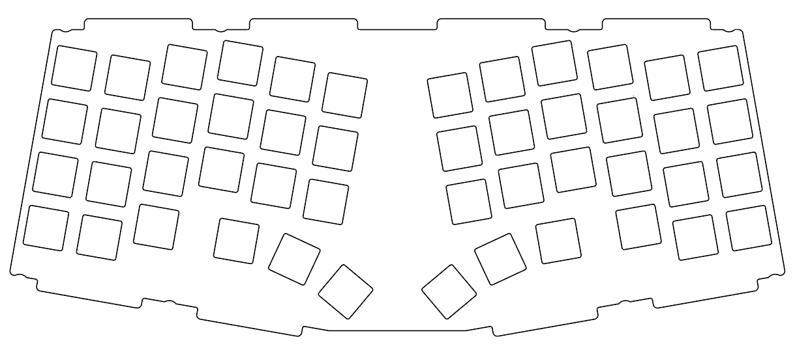
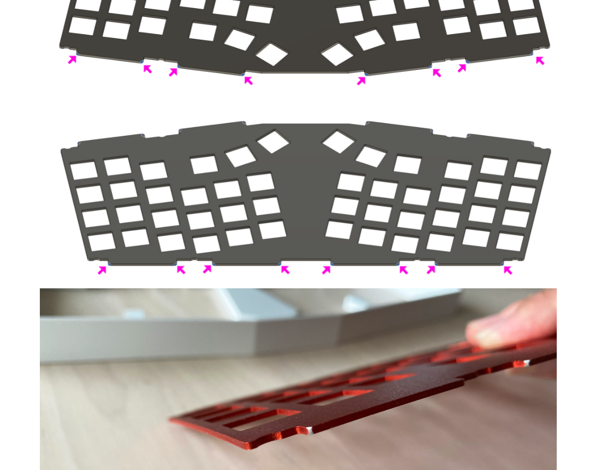
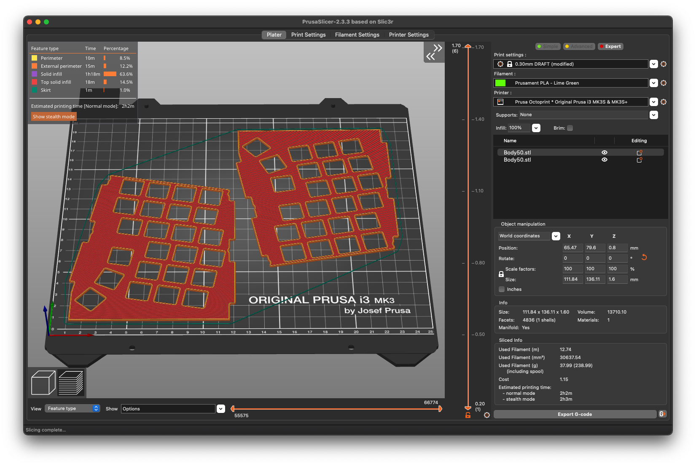

# cornelius-plate
Tweaked plate for Foostan's Cornelius keyboard

If you just want the plate DXF, right click here and hit "save as file": https://raw.githubusercontent.com/godders/cornelius-plate/main/cornelius-plate.dxf

Based on the [official plate file](https://github.com/foostan/corneliuskbd/tree/main/data), but with a couple of minor tweaks:

 * Minimum internal corner radius is now 0.75mm. This is unlikely to make a significant difference to the final product, but it was done to make it compatible with Keebcats' plate group buy.
 * The external radius on the gasket pieces has been increased. Effectively to pre-apply a change recommended in the build guide [when the plate and case rub](https://github.com/foostan/corneliuskbd/blob/main/doc/buildguide_en.md#when-the-top-body-and-plate-interfere-with-each-other):

## Printing

Also included is an STL for half the plate if you want to print a plate (the full plate won't fit on that many printers). You'll need to print two, ideally with one mirrored so they both get a nice finish facing up when you're done. In two halves they easily fit on a Prusa bed:

## Alps?

Yeah I added a DXF for an Alps version, should anyone be feeling intrepid. Thus far this is untested.
